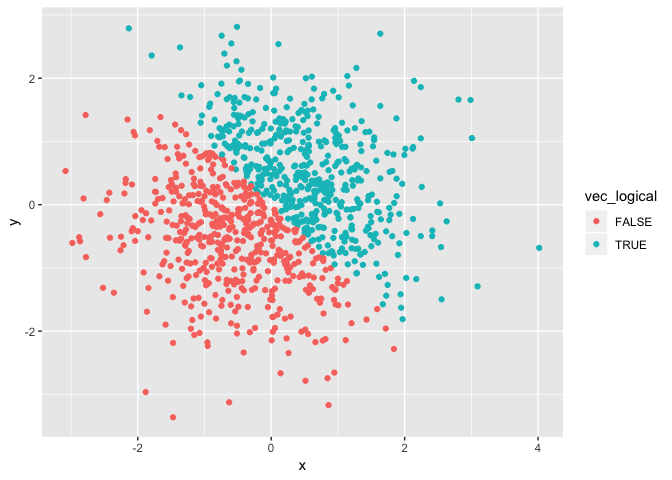
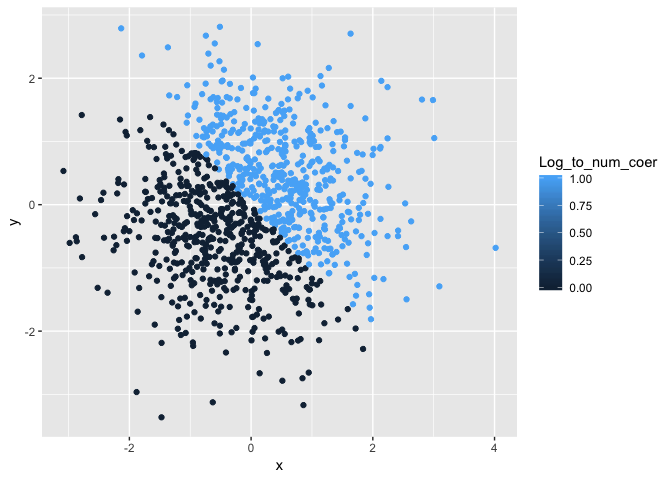
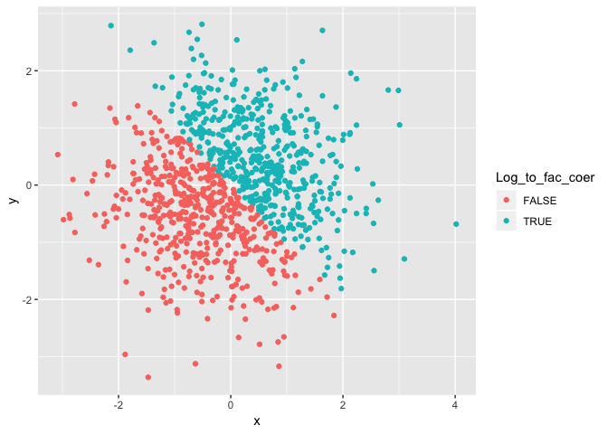

Simple document
================

I'm an R Markdown document!

Problem 1
=========

Here's a **code chunk** that construct the data frame:

``` r
##load library to apply functions

library(tidyverse)
```

    ## ── Attaching packages ──────────────────────────────────────────── tidyverse 1.2.1 ──

    ## ✔ ggplot2 3.0.0     ✔ purrr   0.2.5
    ## ✔ tibble  1.4.2     ✔ dplyr   0.7.6
    ## ✔ tidyr   0.8.1     ✔ stringr 1.3.1
    ## ✔ readr   1.1.1     ✔ forcats 0.3.0

    ## ── Conflicts ─────────────────────────────────────────────── tidyverse_conflicts() ──
    ## ✖ dplyr::filter() masks stats::filter()
    ## ✖ dplyr::lag()    masks stats::lag()

``` r
##construct the data frame

p1data = tibble(
  vec_numeric = runif(10,min=0,max=5),
  vec_char = c("a", "b", "c", "d","e","f","g","h","i","j"),
  vec_factor = factor(c("male", "male", "female", "female","male", "male", "female", "female","male", "male")),
  vec_logical = as.logical(vec_numeric>2)
)

##examine classes

class(p1data$vec_logical)
```

    ## [1] "logical"

Now I try to take the mean of each variable in my dataframe:

The mean of the random sample is 2.3226917. The mean of the logical vector is 0.5. Both the mean of the charater vector and factor vector are NA and NA.

Here's a **code chunk** that tries to convert logical, char and factor to numerical value:

``` r

##convert logical, charater and factor vectors to numberical vectors

Log_to_num = as.numeric(p1data$vec_logical)
Char_to_num = as.numeric(p1data$vec_char)
Fac_to_num = as.numeric(p1data$vec_factor)

##examine classes

class(Log_to_num)
## [1] "numeric"
class(Char_to_num)
## [1] "numeric"
class(Fac_to_num)
## [1] "numeric"
```

``` r
##convert character variable to factor 

Char_to_fac = factor(p1data$vec_char)

##exaime classes

class(Char_to_fac)
```

    ## [1] "factor"

``` r
##convert factor variable to character

Fac_to_char = as.character(p1data$vec_factor)

##exaime classes

class(Fac_to_char)
```

    ## [1] "character"

Problem 2
=========

Here is the **code chunk** that construct the data frame

``` r
p2data = tibble(
  x = rnorm(1000,mean=0),
  y = rnorm(1000,mean=0),
  vec_logical = as.logical(x + y >0),
  
  ##not sure about coersing
  
  Log_to_num_coer = as.numeric (vec_logical),
  Log_to_fac_coer = as.factor(vec_logical)
)

##examine classes

class(p2data$Log_to_num_coer)
```

    ## [1] "numeric"

The size of the data is 1000, 5. The mean of the x is -0.0284501 and the median of the x is -0.0163251. The proportion of the cases for which the logical vector is 0.492.

Here is the **code chunk** that construct the scatterplot:

``` r
library(ggplot2)

ggplot(p2data,
       aes(y = y, x = x, color = vec_logical)) + geom_point()
```



``` r
ggplot(p2data,
       aes(y = y, x = x, color = Log_to_num_coer)) + geom_point()
```



``` r
ggplot(p2data,
       aes(y = y, x = x, color = Log_to_fac_coer)) + geom_point()
```


